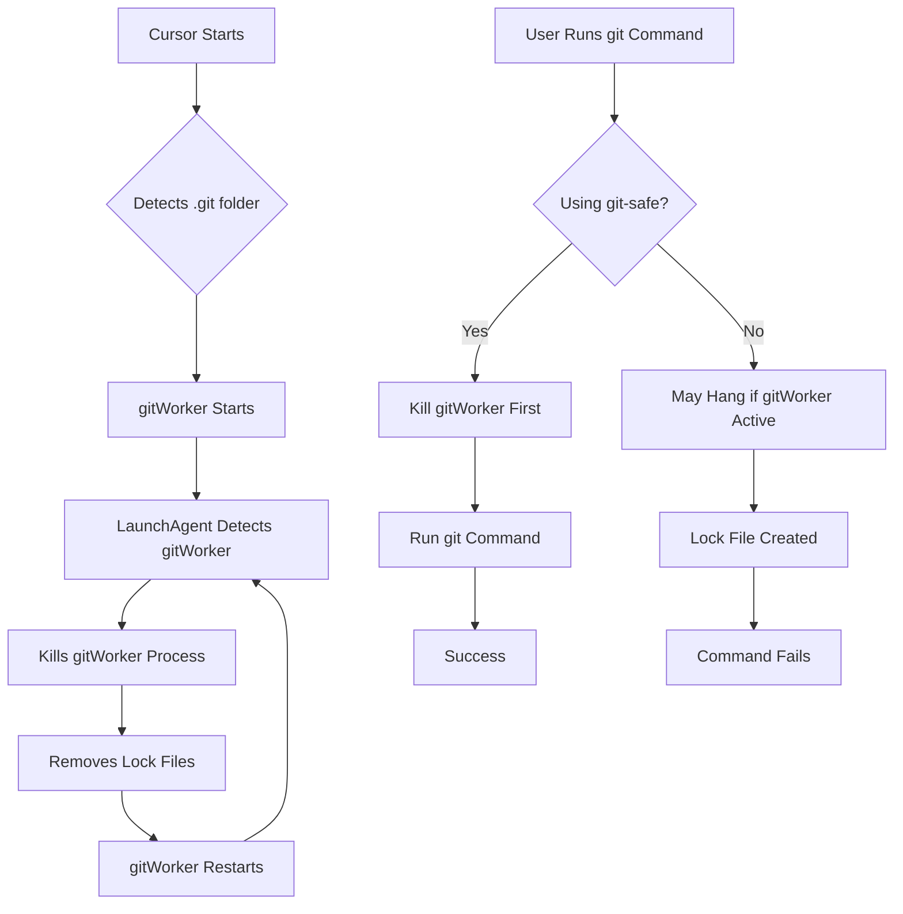

# gitWorker Fix - Permanent Solution

## What is gitWorker?

`gitWorker` is a background process in Cursor IDE that's part of the built-in `cursor-always-local` extension. It's designed to:
- Monitor repository status
- Update the Source Control panel
- Show file change indicators
- Keep Git status up to date

## The Problem

Even with `git.enabled: false` in settings, gitWorker:
- Automatically restarts when Cursor detects a `.git` folder
- Tries to scan large repositories (like ours with 767MB working directory)
- Creates `.git/index.lock` files that block all git operations
- Causes `git add` commands to hang indefinitely
- Interferes with terminal git operations

## Solutions Implemented

We've implemented a **multi-layered defense** to prevent gitWorker from interfering:

### Layer 1: System-Level Auto-Kill (LaunchAgent)

**Location**: `~/Library/LaunchAgents/com.vergo.killgitworker.plist`

A macOS LaunchAgent that runs every 30 seconds to:
- Kill any gitWorker processes
- Kill stuck `git add` processes
- Remove `.git/index.lock` files
- Log actions to `~/.cursor-gitworker-kill.log`

**Status**: Created but needs to be loaded (see Setup below)

### Layer 2: Enhanced Cursor Settings

**Location**: `.vscode/settings.json`

Additional settings to minimize gitWorker activity:
- `extensions.ignoreRecommendations: true` - Prevents extension prompts
- `workbench.editor.enablePreview: false` - Reduces file watching
- Enhanced `files.watcherExclude` to exclude `.git/index.lock`

**Status**: ✅ Active

### Layer 3: Launch Wrapper Script

**Location**: `scripts/launch-cursor-without-gitworker.sh`

A script to launch Cursor with gitWorker already killed:
```bash
./scripts/launch-cursor-without-gitworker.sh
```

**Status**: ✅ Ready to use

### Layer 4: Enhanced Git Wrapper

**Location**: `git-safe`

An improved git wrapper that:
- Checks for gitWorker before running git commands
- Waits longer for processes to die
- Provides better error messages
- Supports all git commands
- Cleans up lock files on failure

**Usage**:
```bash
./git-safe add -A
./git-safe commit -m "Your message"
./git-safe push
```

**Status**: ✅ Enhanced and ready

## Setup Instructions

### 1. Load the LaunchAgent (One-Time Setup)

Run this command to activate the auto-kill daemon:

```bash
launchctl load ~/Library/LaunchAgents/com.vergo.killgitworker.plist
```

To verify it's running:
```bash
launchctl list | grep killgitworker
```

### 2. Verify LaunchAgent is Working

Check the log file to see if it's killing processes:
```bash
tail -f ~/.cursor-gitworker-kill.log
```

You should see entries every 30 seconds if gitWorker is running.

### 3. Use Git Operations

**Option A: Use Mac Terminal (Recommended)**
- Open Mac Terminal (not Cursor's terminal)
- gitWorker won't interfere there
- Use normal git commands

**Option B: Use git-safe wrapper in Cursor**
```bash
./git-safe add -A
./git-safe commit -m "Your message"
```

**Option C: Launch Cursor with wrapper**
```bash
./scripts/launch-cursor-without-gitworker.sh
```

## Troubleshooting

### LaunchAgent Not Working

**Check if it's loaded:**
```bash
launchctl list | grep killgitworker
```

**Reload it:**
```bash
launchctl unload ~/Library/LaunchAgents/com.vergo.killgitworker.plist
launchctl load ~/Library/LaunchAgents/com.vergo.killgitworker.plist
```

**Check log file:**
```bash
cat ~/.cursor-gitworker-kill.log
```

### Git Still Hanging

1. **Kill processes manually:**
   ```bash
   pkill -9 -f gitWorker
   pkill -9 -f "git add"
   rm -f .git/index.lock
   ```

2. **Check if LaunchAgent is running:**
   ```bash
   launchctl list | grep killgitworker
   ```

3. **Use Mac Terminal instead** - gitWorker only runs in Cursor

### Lock File Keeps Appearing

The LaunchAgent should remove it automatically. If not:
1. Check LaunchAgent is loaded
2. Manually remove: `rm -f .git/index.lock`
3. Use `./git-safe` wrapper which removes it before each command

## Disabling the Fix

If you want to remove the LaunchAgent:

```bash
# Unload it
launchctl unload ~/Library/LaunchAgents/com.vergo.killgitworker.plist

# Remove the file
rm ~/Library/LaunchAgents/com.vergo.killgitworker.plist
```

The other solutions (settings, wrappers) will remain but won't auto-kill gitWorker.

## How It Works



## Files Created

1. `~/Library/LaunchAgents/com.vergo.killgitworker.plist` - LaunchAgent config
2. `scripts/kill-gitworker-daemon.sh` - Auto-kill script
3. `scripts/launch-cursor-without-gitworker.sh` - Launch wrapper
4. `git-safe` - Enhanced git wrapper (modified)
5. `.vscode/settings.json` - Enhanced settings (modified)

## Summary

- **Problem**: gitWorker interferes with git operations
- **Solution**: Multi-layered defense (auto-kill, settings, wrappers)
- **Result**: Git operations work reliably
- **Best Practice**: Use Mac Terminal for git, or use `./git-safe` wrapper in Cursor

The LaunchAgent provides the most reliable solution by automatically killing gitWorker every 30 seconds, preventing it from interfering with your work.

